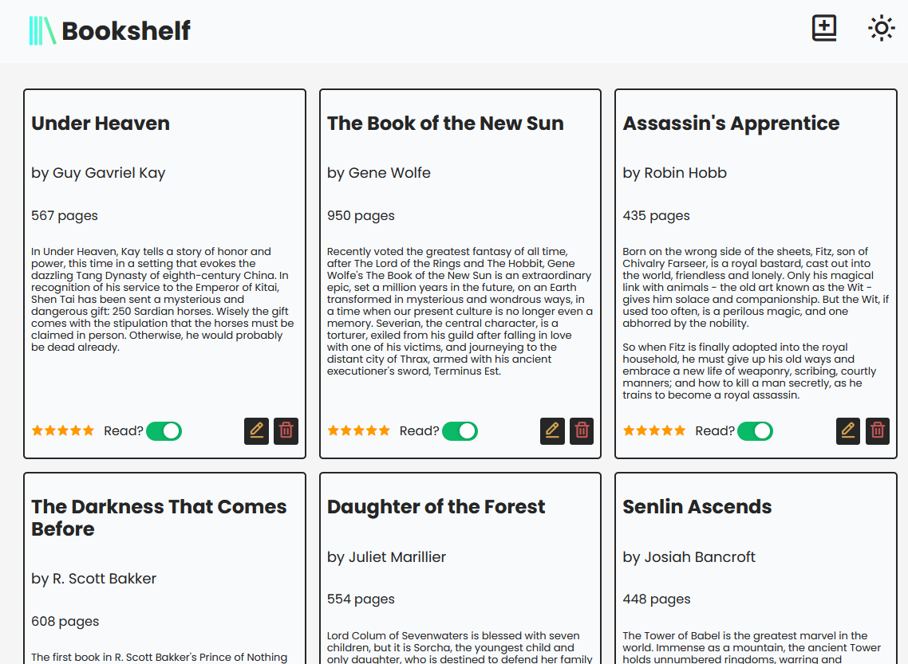

# Library

A simple bookshelf app where you can add, amend and delete books. Built with HTML, JS & CSS.

[Demo here](https://casssb.github.io/library/)

## Thoughts
I spent way longer on this than I should have and I think this has been a lesson in controlling the scope of what I'm trying to build. The suggestions for this project (via [The Odin Project](https://www.theodinproject.com/lessons/node-path-javascript-library)) were to keep the app very basic and just get used to using object constructors but I kept wanting to add more features! I'm a massive reader and use Goodreads a ton so kept being tempted to add features like a star rating system and the ability to update books that have been added. I'm looking forward to coming back to this in the future and adding more functionality.

## Possible Improvements
* I'm planning to add a toggle feature to the book descriptions to save space and make the cards more visually appealing overall.
* I did experiment with setting up the Google Books API to respond to ISBN requests and automatically add in most of the info (as well as adding in an image of the book). I'm planning to make this into a larger personal project in the future.
* I'm not totally happy with the visual style especially on the modal entry form. I've looked into using a ton of UI designing libraries such as Material & Chakra as well as some of the prebuilt components from Tailwind libraries such as DaisyUI and Flowbite. It's really tempting to start using these now but I'd like to get better at vanilla CSS.

## Credits
* Icons taken from [Boxicons](https://boxicons.com/)
* project idea from [The Odin Project](https://www.theodinproject.com/lessons/node-path-javascript-library)

